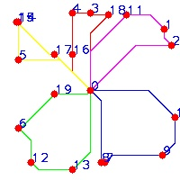

# Ant Colony Algorithms for Multi-agent talk planning

# build

    catkin_make

# execute

    roscore
    rosrun acolanner aco_planner_talker
    rosrun acolanner aco_planner_listener
    rosrun aco_planner aco_planner_node

# explanation
(1) aco_planner_talker  
publish all the task points that multiple agents need to arrive.  

(2) aco_planner_listener  
subscribe the result that ant colony algorithms compute.  

(3) aco_planner_node  
core code to compute the result based on ant colony algorithms.  

# parameters
the map:   (now is a blank map)

	m_srcImg = cvLoadImage("src/aco_planner/src/m_planImg.jpg",-1);         //把原始图形读进m_srcImg

the task nodes:  

    std::string full_path = ros::package::getPath("aco_planner") + "/src/Nodes.txt";

# results
the task points that each agent need to go:  

the planning path for each agent need to go, and different color indicates different agent: 

while other process files can be found in `src/aco_planner/Debug` folder.

# Thanks
Friend [fshi2006](https://github.com/fshi2006).